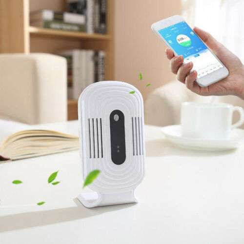

*Please :star: this repo if you find it useful*

# Home Assistant Integration of JQ-300/200/100 Indoor Air Quality Meter

[](https://github.com/Limych/ha-jq300/releases)
[](https://github.com/Limych/ha-jq300/commits/master)
[](LICENSE.md)


[][hacs]


[](https://github.com/Limych/ha-jq300/pulls)
[](https://github.com/Limych/ha-jq300/issues?q=is%3Aopen+is%3Aissue+label%3ABug)

[][forum-support]

This component allows you to

I also suggest you [visit the support topic][forum-support] on the community forum.



_Thanks to [tomaae](https://github.com/tomaae) for the financial support in purchasing the device for creating this project._

## Installation

### HACS - Recommended

1. Have [HACS](https://hacs.xyz) installed, this will allow you to easily manage and track updates.
1. Search for "JQ-300/200/100 Indoor Air Quality Meter".
1. Click Install below the found integration.
1. Configure using the configuration instructions below.
1. Restart Home-Assistant.

### Manual

1. Using the tool of choice open the directory (folder) for your HA configuration (where you find `configuration.yaml`).
2. If you do not have a `custom_components` directory (folder) there, you need to create it.
3. In the `custom_components` directory (folder) create a new folder called `jq300`.
4. Download _all_ the files from the `custom_components/jq300/` directory (folder) in this repository.
5. Place the files you downloaded in the new directory (folder) you created.
1. Configure using the configuration instructions below.
1. Restart Home-Assistant.

Using your HA configuration directory (folder) as a starting point you should now also have this:

```text
custom_components/jq300/__init__.py
custom_components/jq300/const.py
custom_components/jq300/manifest.json
custom_components/jq300/sensor.py
```

<p align="center">* * *</p>
I put a lot of work into making this repo and component available and updated to inspire and help others! I will be glad to receive thanks from you — it will give me new strength and add enthusiasm:
<p align="center"><br>
<a href="https://www.patreon.com/join/limych?" target="_blank"></a>
<br>or&nbsp;support via Bitcoin or Etherium:<br>
<a href="https://sochain.com/a/mjz640g" target="_blank"><br>
16yfCfz9dZ8y8yuSwBFVfiAa3CNYdMh7Ts</a>
</p>

## Usage

To use this component in your installation, add the following to your `configuration.yaml` file:

```yaml
# Example configuration.yaml entry
jq300:
  username: YOUR_EMAIL
  password: YOUR_PASSWORD
```

> **_Note_**:\
> Before using the devices you need to connect them to your account through the official app.
>
> Only one user can be logged into an account at a time. Therefore, each time updated the sensor values from HA, authorization from the official application on your phone will be lost. Authorization is restored when you restart the official application.


### Configuration variables

**username**:\
  _(string) (Required)_\
  The username for accessing your account.

**password**:\
  _(string) (Required)_\
  The password for accessing your account.

**devices**:\
  _(list) (Optional)_\
  List of names of devices to add to Home Assistant.\
  For each device, all sensors are created, which are possible:\
  for all devices: TVOC, HCHO (Formaldehyde) and eCO<sub>2</sub>;\
  for JQ-200 and JQ-300 only: internal temperature and humidity;\
  for JQ-300 only: PM 2.5.\
  _Default value: all available devices_

**receive_tvoc_in_ppm**:\
  _(boolean) (Optional)_\
  By default, the cloud returns the TVOC value in `mg/m³` units. Setting this parameter to `True` allows to receive data in `ppm` units.\
  _Default value: False_

**receive_hcho_in_ppm**:\
  _(boolean) (Optional)_\
  By default, the cloud returns the HCHO (Formaldehyde) value in `mg/m³` units. Setting this parameter to `True` allows to receive data in `ppm` units.\
  _Default value: False_

## Contributions are welcome!

If you want to contribute to this please read the [Contribution guidelines](CONTRIBUTING.md)

## Track updates

You can automatically track new versions of this component and update it by [custom-updater](https://github.com/custom-components/custom_updater) (deprecated) or [HACS][hacs].

For custom-updater to initiate tracking add this lines to you `configuration.yaml` file:

```yaml
# Example configuration.yaml entry
custom_updater:
  track:
    - components
  component_urls:
    - https://raw.githubusercontent.com/Limych/ha-jq300/master/tracker.json
```

## License

creative commons Attribution-NonCommercial-ShareAlike 4.0 International License

See separate [license file](LICENSE.md) for full text.

[forum-support]: https://community.home-assistant.io/t/jq-300-200-100-indoor-air-quality-meter/189098
[hacs]: https://github.com/custom-components/hacs
